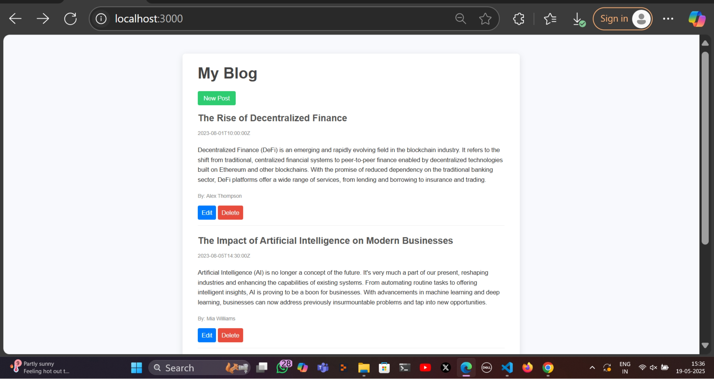
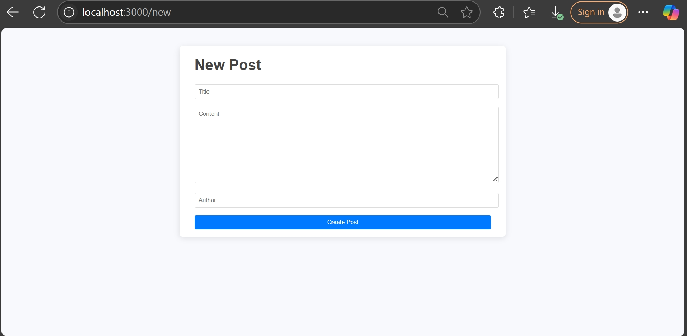
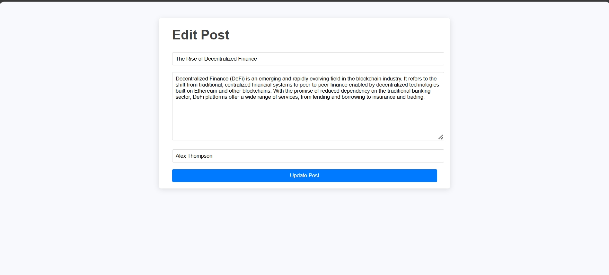

# 📰 Blog Post CRUD Web App

A full-stack blog application built using **Node.js**, **Express**, and **EJS**, demonstrating complete CRUD (Create, Read, Update, Delete) operations with RESTful API integration and a dynamic frontend.

---

## 🌟 Features

* ✅ View all blog posts
* 🆕 Create a new post
* ✏️ Edit and update existing posts
* ❌ Delete blog posts
* 🔁 Support for partial updates with `PATCH`
* 🧠 Clean REST API using Express
* 📄 Dynamic frontend with EJS templating
* ⚡ Axios used for server-side HTTP requests

---

## 🛠️ Tech Stack

* **Node.js** – JavaScript runtime
* **Express.js** – Web framework for Node
* **EJS** – Embedded JavaScript templating
* **Axios** – Promise-based HTTP client
* **Body-Parser** – Middleware for handling request bodies

---

## 📂 Project Structure

```
blog-crud-app/

├── views/           # EJS templates for rendering UI
├── public/          # Static assets (CSS,js)
├── index.js         # Backend API server
├── server.js        # Frontend EJS server
├── screenshots      # webapp operations screenshots
├── package.json     # Dependencies and scripts
```

---

## 🚀 Getting Started

### 1. Clone the Repository


### 2. Install Dependencies

npm install


### 3. Start the Servers

Open **two terminals**:

**Terminal 1 – API Server**


nodemon index.js

**Terminal 2 – Frontend Server**

nodemon server.js


### 4. Open in Browser

Visit: [http://localhost:3000]

---

### Homepage

## 📸 Screenshots

### 🏠 Home Page


### ✏️ Create Post


### 📝 Edit Post


---

## 📬 Contact

If you have questions or want to connect:

* 💼 [LinkedIn](https://www.linkedin.com/in/yogeshwarisakharwade)
* 🐙 [GitHub](https://github.com/Yogeshwari1703)

---
